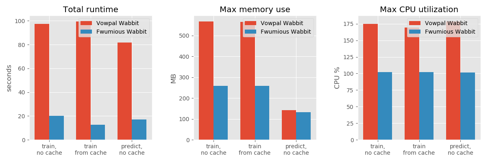

Fwumious Wabbit is
- a very fast machine learning tool
- built with Rust
- inspired by and partially compatible with Vowpal Wabbit (much love! read more about compatibility [here](COMPATIBILITY.md))
- currently supports logistic regression and field-aware factorization machines

Fwumious Wabbit is actively used in Outbrain for offline research, as well as for some production flows. It 
enables "high bandwidth research" when doing feature engineering, feature 
selection, hyper-parameter tuning, and the like. 

Data scientists can train hundreds of models over hundreds of millions of examples in 
a matter of hours on a single machine.

For our tested scenarios it is almost two orders of magnitude faster than the 
fastest Tensorflow implementation of Logistic Regression and FFMs that we could 
come up with. 
It is an order of magnitude faster than Vowpal Wabbit for some specific use-cases.

Check out our [benchmark](BENCHMARK.md), here's a teaser:

**Why is it faster?** (see [here](SPEED.md) for more details)
- Only implements Logistic Regression and Field-aware Factorization Machines
- Uses hashing trick, lookup table for AdaGrad and a tight encoding format for the "input cache"
- Features' namespaces have to be declared up-front
- Prefetching of weights from memory (avoiding pipeline stalls)
- Written in Rust with heavy use of code specialization (via macros and traits)

